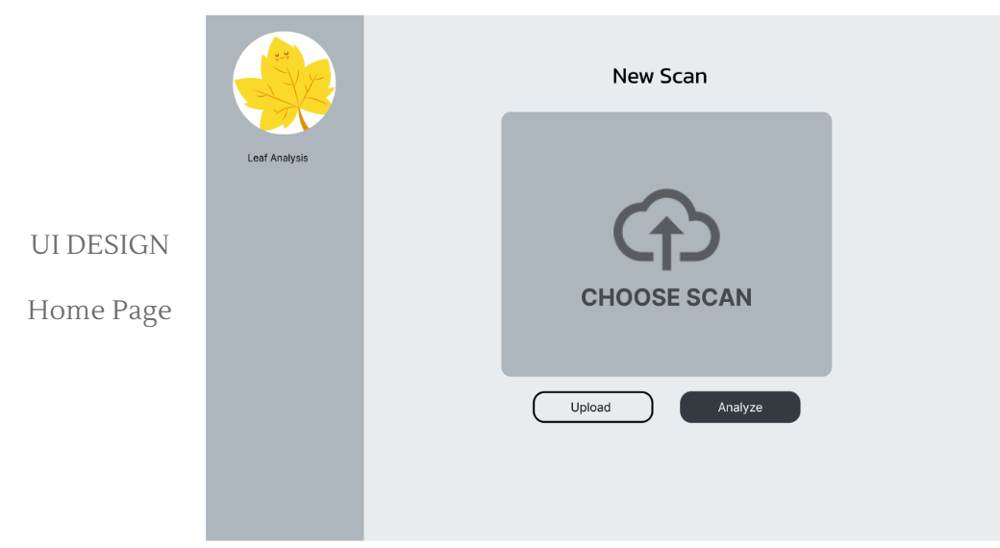
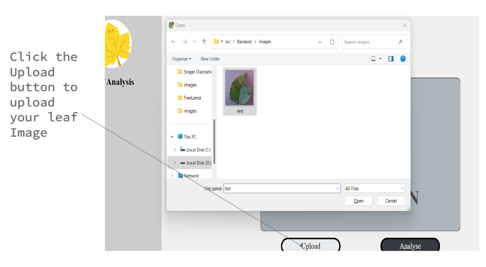
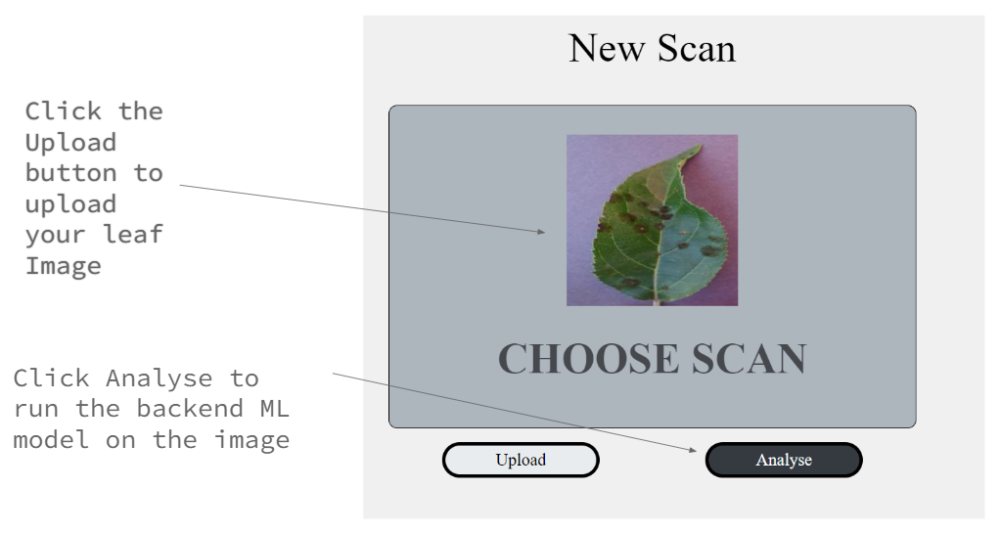
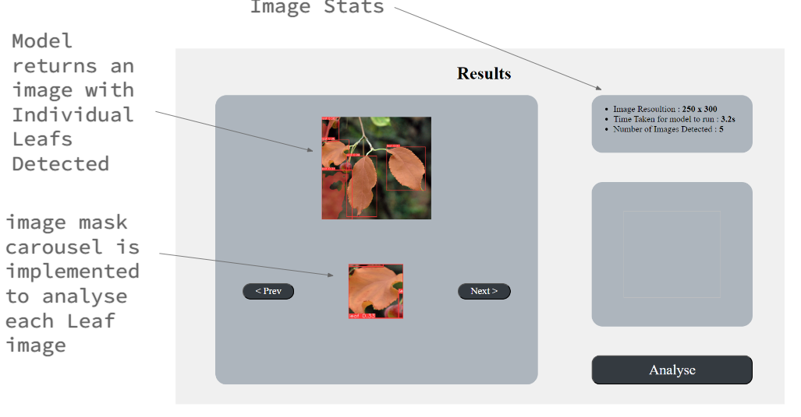
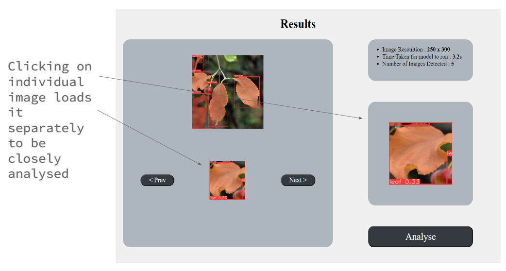
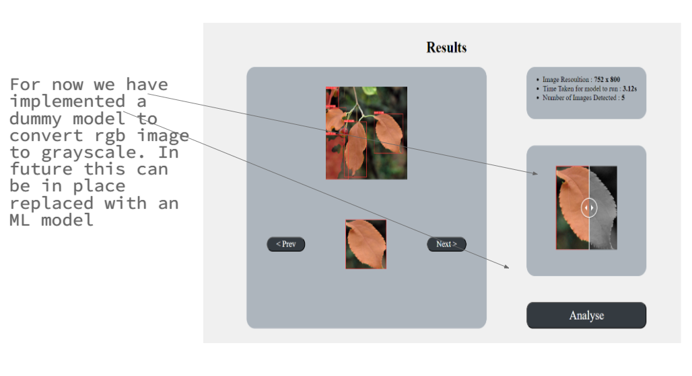

# Leaf_disease_detection
## Leaf Detection Project integrating an ML Pipeline 

Welcome to my awesome project! This repository contains the source code and documentation for...

### Getting Started

To get started with this project, follow these steps:

1. Clone the repository to your local machine.
   ```bash
   https://github.com/aku221b/Leaf_disease_detection.git
   ```
2. run the following command to install frontend dependecies in the root folder
   ```bash
   npm install
   ```
3. Initiate a new conda environment with python version 3.10. install all the necessary python libraries
4. run merger.py file in Backend folder to initiate the backend server
   ```bash
   python merger.py
   ```
5. Now to initate the dev server run
   ```
   npm start
   ```
### Interface

1. Home Page
    
2. Upload utlity
    
3. Click Analyse
    
4. Loader
   
5. Results Page
   
6. Further Analysis
   
7. Color to Gray scale as a dummy backend model 
   
